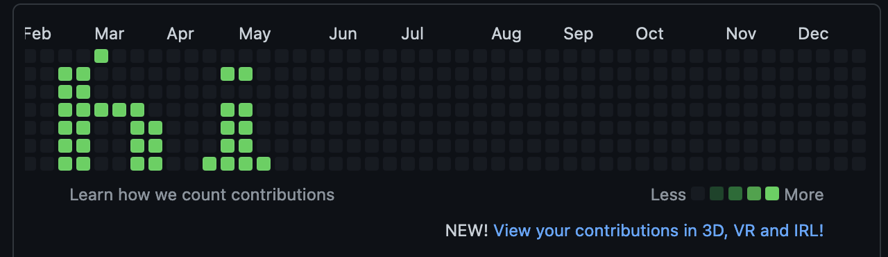

# github-contribution-pixel-art
Simple Javascript solution to write in your GitHub contribution graph.

### Getting Started
- install latest node/npm
- install required dependencies with npm
- update variables according to your need in `pusher.js`
```javascript
const START_DATE_STRING = "2016-02-14"; // from the point the art will start from. the upper left pixel of contribution graph
const STRING = "hi" // Input what you want to print here
```
- run pusher.js
```shell
 $ node pusher.js  
```
- push the commits
```shell
$ git push
```
- checkout your contribution graph



### How it works
The binary maps of the letters are kept in `letterHexList` in hexadecimal format. It was prepared using [LED Matrix Editor](https://xantorohara.github.io/led-matrix-editor/).
However, these hex values are for 8x8 matrix displays. Later, it was trimmed into 7x7 matrices hex values. After that,
the 7x7 matrices are rotated to get it prepared to print in the contribution graph.

#### Why 7x7 matrix
The contribution graph's height is 7 pixels.

#### How 'printing' works
To get a lit pixel, the code pushes 20 commits for that specific pixel. A pixel is identified by a date.

#### How commits are made
The script appends **X** in `data.txt` and commits the change.

### Acknowledgments
- [Mr. Sayem Shafayet](https://github.com/iShafayet) for inspiring me with the idea and helping me with the base script
- [LED Matrix Editor](https://xantorohara.github.io/led-matrix-editor/)


